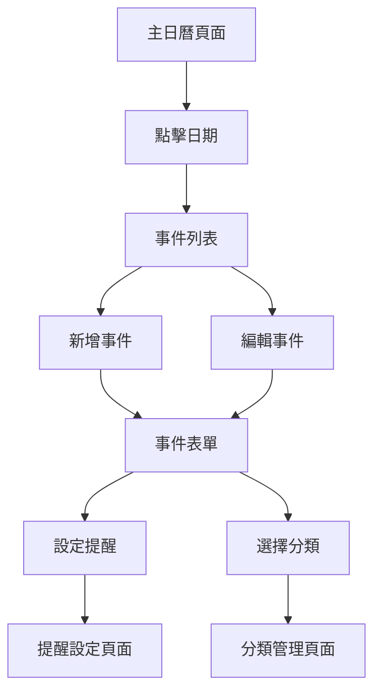

## 1. 產品概述

日曆提醒App是一個功能完整的個人行事曆管理工具，幫助使用者有效管理日常行程和重要事件。透過直觀的介面設計和強大的提醒功能，讓使用者不會錯過任何重要時刻。

目標用戶包括需要管理個人行程的上班族、學生、家庭主婦等，提供簡單易用的事件管理和提醒服務。

## 2. 核心功能

### 2.1 使用者角色

| 角色 | 註冊方式 | 核心權限 |
|------|----------|----------|
| 一般使用者 | 無需註冊，本地使用 | 完整使用所有日曆功能，資料儲存在本地 |

### 2.2 功能模組

本日曆提醒App包含以下主要頁面：

1. **主日曆頁面**：月視圖日曆、日期導航、事件顯示、快速新增
2. **事件管理頁面**：事件編輯表單、刪除確認、重複事件設定
3. **提醒設定頁面**：通知偏好、提醒時間、音效選擇
4. **分類管理頁面**：事件分類、顏色設定、圖標選擇

### 2.3 頁面詳情

| 頁面名稱 | 模組名稱 | 功能描述 |
|----------|----------|----------|
| 主日曆頁面 | 月視圖日曆 | 顯示當月所有日期，支援上下月切換，標記今日日期，顯示事件數量和顏色標記 |
| 主日曆頁面 | 事件列表 | 顯示選中日期的所有事件，包含時間、標題、描述，支援編輯和刪除操作 |
| 主日曆頁面 | 快速新增 | 點擊日期可直接新增事件，開啟事件編輯表單 |
| 事件管理頁面 | 事件編輯 | 編輯事件標題、時間、描述、顏色分類，支援全天事件和具體時間設定 |
| 事件管理頁面 | 重複事件 | 設定事件重複規則（每日、每週、每月、每年），自動生成系列事件 |
| 事件管理頁面 | 刪除功能 | 刪除單一事件或整個重複事件系列，包含確認對話框防止誤操作 |
| 提醒設定頁面 | 通知設定 | 開啟/關閉提醒通知，設定提前提醒時間（15分鐘至1天） |
| 提醒設定頁面 | 音效選擇 | 選擇提醒音效，支援靜音模式，可預覽音效效果 |
| 分類管理頁面 | 分類編輯 | 新增、編輯、刪除事件分類，自訂分類名稱和顏色 |
| 分類管理頁面 | 圖標系統 | 為每個分類選擇圖標，提供常用圖標庫供選擇 |

## 3. 核心流程

### 一般使用者流程

1. **瀏覽日曆**：使用者開啟App後看到月視圖，可以點擊不同日期查看事件
2. **新增事件**：點擊日期或新增按鈕，填寫事件資訊並保存
3. **編輯事件**：點擊現有事件進行修改，可更改所有屬性
4. **設定提醒**：為重要事件設定提醒通知，確保不會遺忘
5. **管理分類**：建立個人化的事件分類系統，用顏色區分不同類型事件

## 4. 使用者介面設計

### 4.1 設計風格

- **主要色彩**：藍色系（#4285f4）作為主色調，搭配淺灰色背景
- **次要色彩**：綠色（#34a853）表示成功，紅色（#ea4335）表示警告或刪除
- **按鈕樣式**：圓角矩形設計，懸停效果明顯，點擊回饋清晰
- **字體選擇**：系統預設字體，確保跨平台一致性
- **佈局風格**：卡片式設計，陰影效果，清晰的視覺層次
- **圖標風格**：使用Font Awesome圖標庫，保持圖標風格統一

### 4.2 頁面設計概述

| 頁面名稱 | 模組名稱 | 介面元素 |
|----------|----------|----------|
| 主日曆頁面 | 月視圖 | 7x6網格佈局，每個日期格子100px高度，顯示日期數字和事件標記，今日日期特殊背景色 |
| 主日曆頁面 | 事件列表 | 右側面板顯示選中日期事件，每個事件有顏色背景、時間、標題，編輯按鈕在右上角 |
| 事件表單 | 編輯介面 | 模態框設計，包含標題輸入框、時間選擇器、描述文字區域、顏色選擇下拉選單 |
| 提醒設定 | 通知面板 | 開關按鈕控制提醒開關，下拉選單選擇提前時間，音效選擇器支援預覽 |

### 4.3 響應式設計

- **桌面優先**：預設為桌面版設計，主介面採用左右分欄佈局
- **手機適配**：螢幕寬度小於768px時，改為單欄佈局，日曆格子高度調整為80px
- **觸控優化**：按鈕和可點擊元素最小44px觸控區域，支援手勢操作
- **字體適配**：根據螢幕尺寸調整字體大小，確保手機上可讀性

## 5. 技術需求

### 5.1 前端技術
- HTML5、CSS3、JavaScript ES6+
- 本地儲存使用localStorage
- 支援現代瀏覽器（Chrome、Firefox、Safari、Edge）

### 5.2 資料儲存
- 事件資料以JSON格式儲存在localStorage
- 使用者設定儲存在本地
- 支援資料匯出/匯入功能

### 5.3 通知系統
- 使用瀏覽器Notification API
- 支援桌面通知和行動裝置推播
- 需要使用者授權通知權限

## 6. 效能要求

### 6.1 載入效能
- 初始載入時間小於2秒
- 日曆渲染時間小於500毫秒
- 事件資料載入非同步進行

### 6.2 操作效能
- 日期切換響應時間小於200毫秒
- 事件新增/編輯即時保存
- 大量事件（1000+）下保持流暢操作

### 6.3 記憶體管理
- 及時清理不需要的DOM元素
- 事件監聽器適時移除
- 避免記憶體洩漏問題

## 7. 未來擴展功能

### 7.1 雲端同步
- 支援多裝置資料同步
- 雲端備份和恢復功能
- 帳號系統整合

### 7.2 進階功能
- 與其他日曆服務整合（Google日曆、Outlook）
- 團隊共享日曆功能
- AI智慧提醒建議

### 7.3 平台擴展
- 開發行動App版本
- 桌面應用程式版本
- 瀏覽器擴充功能