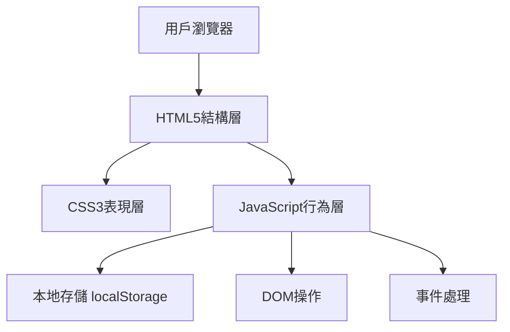
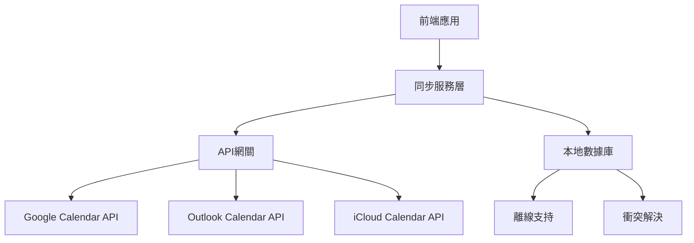

# 日曆提醒App技術架構設計文件

## 1. 系統架構概述

### 1.1 前端架構
目前採用純前端技術棧，基於HTML5、CSS3和原生JavaScript實現，無需後端服務器支持。



### 1.2 資料流架構
- **單向數據流**：JavaScript管理應用狀態，DOM反映狀態變化
- **本地存儲**：使用localStorage持久化事件數據
- **事件驅動**：用戶操作觸發事件，更新數據和UI

### 1.3 模組劃分
```
├── UI模組（日曆渲染、事件展示）
├── 數據模組（事件管理、本地存儲）
├── 業務邏輯模組（日期計算、事件操作）
└── 工具模組（格式化、驗證）
```

## 2. 現有程式碼分析

### 2.1 HTML結構分析
**優點**：
- 語義化標籤使用恰當（header、main、section等）
- 響應式meta標籤配置完整
- 模態框結構清晰

**缺點**：
- 缺少ARIA無障礙屬性
- 表單缺少驗證屬性（min、max等）
- 沒有載入狀態指示器

### 2.2 CSS設計分析
**優點**：
- CSS變數使用合理，便於主題定制
- 響應式設計完善（768px斷點）
- Grid佈局使用恰當

**缺點**：
- 缺少深色主題支持
- 動畫過渡效果較少
- 沒有CSS模組化組織

### 2.3 JavaScript邏輯分析
**優點**：
- 全局狀態管理清晰
- 事件監聽器組織合理
- 本地存儲操作封裝良好

**缺點**：
- 全局變數污染（應使用模組模式）
- 缺少錯誤處理機制
- 沒有代碼分割和懶加載
- 性能優化不足（頻繁DOM操作）

## 3. 模組設計優化

### 3.1 日曆模組（CalendarModule）
```javascript
class CalendarModule {
    constructor() {
        this.currentDate = new Date();
        this.selectedDate = new Date();
        this.container = document.getElementById('calendar-days');
    }
    
    render() { /* 渲染日曆 */ }
    navigateMonth(direction) { /* 月份導航 */ }
    selectDate(date) { /* 日期選擇 */ }
    getMonthData() { /* 獲取月份數據 */ }
}
```

### 3.2 事件管理模組（EventManager）
```javascript
class EventManager {
    constructor() {
        this.events = new Map();
        this.storage = new StorageService();
    }
    
    async loadEvents() { /* 載入事件 */ }
    async saveEvent(event) { /* 保存事件 */ }
    async deleteEvent(eventId) { /* 刪除事件 */ }
    getEventsByDate(date) { /* 按日期獲取事件 */ }
    searchEvents(keyword) { /* 搜索事件 */ }
}
```

### 3.3 提醒模組（ReminderModule）
```javascript
class ReminderModule {
    constructor() {
        this.notifications = new Map();
        this.checkInterval = 60000; // 1分鐘檢查一次
    }
    
    startReminderService() { /* 啟動提醒服務 */ }
    scheduleReminder(event) { /* 安排提醒 */ }
    cancelReminder(eventId) { /* 取消提醒 */ }
    showNotification(event) { /* 顯示通知 */ }
}
```

### 3.4 UI模組（UIManager）
```javascript
class UIManager {
    constructor() {
        this.modals = new Map();
        this.templates = new Map();
    }
    
    showModal(modalId, data) { /* 顯示模態框 */ }
    hideModal(modalId) { /* 隱藏模態框 */ }
    updateEventList(events) { /* 更新事件列表 */ }
    showLoading(state) { /* 顯示載入狀態 */ }
    showToast(message, type) { /* 顯示提示 */ }
}
```

## 4. 資料結構設計

### 4.1 事件資料格式
```javascript
const EventSchema = {
    id: 'string',           // 唯一識別碼
    title: 'string',        // 事件標題
    description: 'string', // 事件描述
    date: 'string',         // 日期 (YYYY-MM-DD)
    time: 'string',         // 時間 (HH:MM)
    endTime: 'string',      // 結束時間
    color: 'string',        // 顏色代碼
    reminder: {
        enabled: 'boolean', // 是否啟用提醒
        minutes: 'number', // 提前幾分鐘提醒
        type: 'string'     // 提醒類型 (notification, email, sms)
    },
    recurrence: {
        type: 'string',     // 重複類型 (daily, weekly, monthly, yearly)
        interval: 'number', // 重複間隔
        endDate: 'string'  // 重複結束日期
    },
    category: 'string',     // 事件分類
    priority: 'number',     // 優先級 (1-5)
    location: 'string',     // 地點
    attendees: ['string'],  // 參與者
    createdAt: 'string',    // 創建時間
    updatedAt: 'string'    // 更新時間
};
```

### 4.2 本地儲存結構
```javascript
// localStorage 結構
{
    "calendar_events": {
        "2024-01-01": [event1, event2, ...],
        "2024-01-02": [event3, event4, ...]
    },
    "calendar_settings": {
        "theme": "light|dark",
        "weekStart": 0|1,        // 0:週日, 1:週一
        "timeFormat": "12h|24h",
        "defaultReminder": 15,   // 默認提前15分鐘提醒
        "categories": ["工作", "個人", "會議", "生日"],
        "colors": ["#4285f4", "#ea4335", "#fbbc05", "#34a853"]
    },
    "calendar_cache": {
        "lastSync": "2024-01-01T00:00:00Z",
        "version": "1.0.0"
    }
}
```

### 4.3 設定資料格式
```javascript
const SettingsSchema = {
    theme: {
        mode: 'light|dark|auto',
        primaryColor: 'string',
        fontSize: 'small|medium|large'
    },
    calendar: {
        defaultView: 'month|week|day',
        weekStartDay: 0|1|2|3|4|5|6,
        showWeekNumbers: 'boolean',
        showOtherMonthDays: 'boolean'
    },
    notifications: {
        enabled: 'boolean',
        sound: 'boolean',
        vibration: 'boolean',
        quietHours: {
            enabled: 'boolean',
            start: 'string',    // HH:MM
            end: 'string'       // HH:MM
        }
    },
    sync: {
        enabled: 'boolean',
        provider: 'google|outlook|icloud',
        frequency: 'number',   // 同步頻率（分鐘）
        lastSync: 'string'     // ISO日期字符串
    }
};
```

## 5. API設計

### 5.1 內部函數介面
```javascript
// 日曆API
CalendarAPI {
    getCalendarData(year, month): Promise<CalendarData>
    navigateToDate(date): void
    selectDate(date): void
    getSelectedDate(): Date
}

// 事件API
EventAPI {
    createEvent(eventData): Promise<Event>
    updateEvent(eventId, updates): Promise<Event>
    deleteEvent(eventId): Promise<boolean>
    getEvents(dateRange): Promise<Event[]>
    searchEvents(criteria): Promise<Event[]>
}

// 提醒API
ReminderAPI {
    setReminder(eventId, reminderConfig): Promise<void>
    cancelReminder(eventId): Promise<void>
    getUpcomingReminders(): Promise<Reminder[]>
    snoozeReminder(reminderId, minutes): Promise<void>
}
```

### 5.2 模組間通訊方式
```javascript
// 事件總線模式
class EventBus {
    constructor() {
        this.events = {};
    }
    
    on(event, callback) {
        if (!this.events[event]) {
            this.events[event] = [];
        }
        this.events[event].push(callback);
    }
    
    emit(event, data) {
        if (this.events[event]) {
            this.events[event].forEach(callback => callback(data));
        }
    }
    
    off(event, callback) {
        if (this.events[event]) {
            this.events[event] = this.events[event].filter(cb => cb !== callback);
        }
    }
}

// 使用示例
eventBus.emit('event:created', newEvent);
eventBus.on('event:created', (event) => {
    calendarModule.refresh();
    reminderModule.scheduleReminder(event);
});
```

## 6. 擴展性規劃

### 6.1 雲端同步架構


### 6.2 多平台支持策略
1. **漸進式Web應用（PWA）**
   - Service Worker實現離線功能
   - Web App Manifest實現桌面安裝
   - Push API實現推送通知

2. **移動端適配**
   - 響應式設計優化
   - 觸摸手勢支持
   - 原生應用封裝（Cordova/Capacitor）

3. **桌面端應用**
   - Electron封裝
   - 系統托盤集成
   - 全局快捷鍵支持

### 6.3 插件系統設計
```javascript
// 插件接口
interface CalendarPlugin {
    name: string;
    version: string;
    activate(context: PluginContext): void;
    deactivate(): void;
}

// 插件管理器
class PluginManager {
    registerPlugin(plugin: CalendarPlugin): void
    unregisterPlugin(pluginId: string): void
    getPlugin(pluginId: string): CalendarPlugin
    executeHook(hookName: string, ...args: any[]): Promise<any[]>
}
```

## 7. 效能優化策略

### 7.1 渲染優化
1. **虛擬滾動**
   - 大量事件列表使用虛擬滾動
   - 只渲染可視區域內的元素

2. **DOM批量更新**
   ```javascript
   // 使用DocumentFragment批量操作
   const fragment = document.createDocumentFragment();
   events.forEach(event => {
       fragment.appendChild(createEventElement(event));
   });
   container.appendChild(fragment);
   ```

3. **防抖和節流**
   ```javascript
   // 搜索功能防抖
   const debouncedSearch = debounce(searchEvents, 300);
   
   // 滾動事件節流
   const throttledScroll = throttle(handleScroll, 100);
   ```

### 7.2 記憶體管理
1. **事件監聽器清理**
   ```javascript
   class EventManager {
       constructor() {
           this.listeners = new Map();
       }
       
       addEventListener(element, event, handler) {
           element.addEventListener(event, handler);
           this.listeners.set(`${element.id}_${event}`, { element, event, handler });
       }
       
       cleanup() {
           this.listeners.forEach(({ element, event, handler }) => {
               element.removeEventListener(event, handler);
           });
           this.listeners.clear();
       }
   }
   ```

2. **對象池技術**
   ```javascript
   class ObjectPool {
       constructor(createFn, resetFn, maxSize = 100) {
           this.createFn = createFn;
           this.resetFn = resetFn;
           this.pool = [];
           this.maxSize = maxSize;
       }
       
       acquire() {
           return this.pool.pop() || this.createFn();
       }
       
       release(obj) {
           if (this.pool.length < this.maxSize) {
               this.resetFn(obj);
               this.pool.push(obj);
           }
       }
   }
   ```

### 7.3 載入效能
1. **代碼分割**
   ```javascript
   // 路由懶加載
   const CalendarView = () => import('./views/CalendarView.js');
   const SettingsView = () => import('./views/SettingsView.js');
   
   // 功能模組按需載入
   async function loadAdvancedFeatures() {
       const { AdvancedFeatures } = await import('./AdvancedFeatures.js');
       return new AdvancedFeatures();
   }
   ```

2. **資源預載入**
   ```html
   <link rel="preload" href="/css/critical.css" as="style">
   <link rel="preload" href="/js/core.js" as="script">
   <link rel="prefetch" href="/js/advanced-features.js">
   ```

3. **Service Worker緩存策略**
   ```javascript
   // 緩存策略配置
   const cacheStrategies = {
       // 核心資源：網絡優先
       core: new NetworkFirst({ cacheName: 'core-cache' }),
       
       // 樣式腳本：緩存優先
       assets: new CacheFirst({ cacheName: 'assets-cache' }),
       
       // API請求：過期重新驗證
       api: new StaleWhileRevalidate({ cacheName: 'api-cache' })
   };
   ```

### 7.4 性能監控
```javascript
class PerformanceMonitor {
    constructor() {
        this.metrics = new Map();
        this.thresholds = {
            renderTime: 100,    // 渲染時間閾值（ms）
            loadTime: 2000,     // 載入時間閾值（ms）
            memoryUsage: 50     // 內存使用閾值（MB）
        };
    }
    
    measure(name, fn) {
        const start = performance.now();
        const result = fn();
        const duration = performance.now() - start;
        
        this.recordMetric(name, duration);
        
        if (duration > this.thresholds[name]) {
            this.reportPerformanceIssue(name, duration);
        }
        
        return result;
    }
    
    recordMetric(name, value) {
        if (!this.metrics.has(name)) {
            this.metrics.set(name, []);
        }
        this.metrics.get(name).push(value);
    }
}
```

## 8. 總結

本技術架構設計文件詳細分析了現有日曆提醒應用的架構，並提出了全面的優化方案。通過模組化設計、合理的資料結構、完善的API設計以及性能優化策略，能夠顯著提升應用的可維護性、擴展性和用戶體驗。

關鍵改進點：
1. **架構升級**：從單一文件轉向模組化架構
2. **功能擴展**：增加提醒、重複事件、搜索等進階功能
3. **性能優化**：實施虛擬滾動、防抖節流、代碼分割等優化
4. **擴展性**：設計插件系統和雲端同步架構
5. **用戶體驗**：增加載入狀態、錯誤處理、無障礙支持

這些優化將使應用能夠更好地應對未來的功能擴展和性能要求。